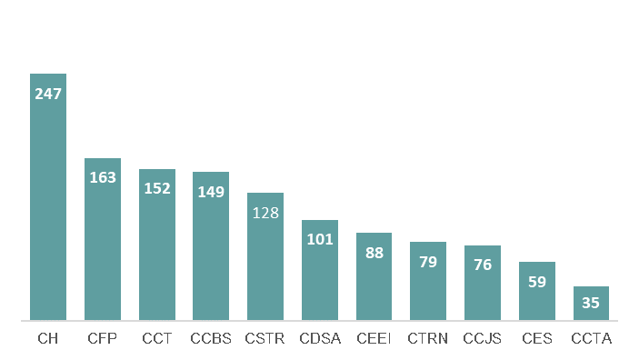

 
A primeira atividade desenvolvida no Estágio, foi a elaboração do plano de amostragem para avaliar a Experiência do Usuário em uma Plataforma online.

## O que é a experiência do usuário?

A experiência do usuário (UX) pode ser definido como o processo que visa aumentar a satisfação final do usuário. Isso inclui conceitos como usabilidade, interação e solução do problema inicial apresentado. Por meio dele é possível ter uma visão melhor de como as pessoas enxergam o seu produto, afinal, isso vai dizer muito a respeito dos resultados obtidos. Para fortalecer esse sistema, é necessário utilizar elementos como design interativo, arquitetura da informação, pesquisa do usuário e afins. Tudo visando melhorar a experiência do usuário como um todo.

Na última década a UX se voltou principalmente para sites, aplicativos móveis, ferramentas e outros recursos similares. Hoje, quando falamos em marketing e vendas, a experiência do usuário é considerada uma das principais estratégias para conseguir a conversão e a confiança dos consumidores e, consequentemente, os tornarem mais leais.

Para as empresas, isso implica um maior esforço para desenvolver uma presença digital que esteja alinhada com as necessidade do cliente. Isto é, que seja coerente, atraente, e adaptável.

Ok! Entendi a importância em avaliar a experiência do usuário, mas onde fica a Estatística nisso? Poderia citar aqui várias aplicações da Estatística em UX, mas vamos nos deter ao problema apresentado no meu Estágio.

#### Imagine a seguinte situação: 

Durante a pandemia, as Universidades precisaram repensar e adaptar o desenvolvimento das atividades para o formato remoto, adotado por conta da interrupção do calendário letivo. Para tanto, foi adotado o uso de uma plataforma online, o Sistema Eletrônico de Informação (SEI). 

O método de avaliação utilizado para saber se o Sistema adotado atendia as necessidades dos usuários, foi definido por um aluno do mestrado em *Design*. O método consistia em mostrar um ícone ao usuário e solicitar que o mesmo o defina. Para avaliar a satisfação e uso, foi feito um teste de usabilidade e, após o teste, a aplicação de um questionário.

Como delimitação da pesquisa, o público alvo era composto pelos professores da Universidade Federal de Campina Grande que não possuíam cargos administrativos. Mas, como saber a quantidade de professores necessária para atender a necessidade da pesquisa? Através de técnicas de Amostragem. **E é aqui que a Estatística entra!**

## Desenvolvimento 

Após realizar uma pesquisa acerca dos centros acadêmicos e cursos de graduação ofertados pela UFCG, verificamos que a Universidade oferece 95 cursos de graduação, distribuídos por seus 7 campi e 11 centros acadêmicos localizados no estado da Paraíba. Além disso, verificamos que a quantidade de professores variava de acordo com os centros acadêmicos e/ou campi. As informações acerca da quantidade de professores em cada centro foram obtidas através dos sites oficiais da Universidade e confirmadas pela Pró-Reitoria de Ensino (PRE) da UFCG. O gráfico abaixo apresenta a distribuição dos professores de acordo com o Centro Acadêmico.

    
  
  *Figura 1: Gráfico de barras relativo a Quantidade de professores da UFCG de acordo com o Centro Acadêmico.*
  

Baseando-se na distribuição dos professores pelos centros acadêmicos da UFCG, constatamos que havia heterogeneidade entre eles, ou seja, além da quantidade de professores variar de acordo com os centros, outros fatores como idade, gênero, área de atuação, etc, impossibilitava a utilização de uma amostragem aleatória simples. Quando se trata de populações heterogêneas a metodologia mais indicada é a amostragem estratificada. Dessa forma, utilizamos a amostragem estratificada proporcional, retirando amostras separadas de cada um dos 11 centros acadêmicos da UFCG.

#### Amostragem Estratificada.

A amostragem estratificada consiste na divisão de uma população em subpopulações ou estratos, homogêneos internamente, mas heterogêneos entre si, segundo alguma característica conhecida na população em estudo. Em cada um desses estratos, são selecionadas amostras em proporções convenientes.

Para a determinação do tamanho das amostras dentro dos estratos, foi utilizado o método de alocação proporcional. Com esse procedimento, a amostra aleatória é distribuída proporcionalmente ao tamanho dos estratos. Todos os cálculos para a obtenção das amostras podem ser encontrados em: [Notas de aula](https://rodriguesbianca.notion.site/Notas-de-aula-c44dd564e52f44c083d336ef56c239da).

## Resultados

Para determinar o tamanho da amostra, é preciso fixar o erro máximo desejado com um determinado grau de confiança, além de ter um conhecimento prévio sobre a estimativa da variabilidade (`$\sigma^2$`), ou da proporção (`$p$`) da característica de interesse na população.

Após verificar a quantidade de professores presentes em cada centro acadêmico, calculei o tamanho da amostra considerando o nível de confiança `$\gamma = 0, 95$`. Utilizando da distribuição normal acumulada, tem-se que o valor de `$z_{0,975} = 1,96$`. Assim, após considerar vários erros máximos de estimação obtivemos os resultados apresentados na Tabela abaixo.

| Erro         | 5%  | **8%**  | 10% | 13% | 15% | 18% | 20% |
|--------------|-----|-----|-----|-----|-----|-----|-----|
| Amostra (`$n$`)| 384 | **150** | 96  | 57  | 43  | 30  | 24  |

Inicialmente, considerou-se `$n = 96$`, entretanto, após distribuir este tamanho da amostra entre os onze estratos (centros), é possível perceber que os centros acadêmicos com maior quantidade de professores têm proporcionalmente uma taxa de amostragem mais elevada, e aqueles cujos números de professores eram pequenos iriam ter amostras extremamente pequenas. Devido a este aspecto, incrementou-se o tamanho da amostra para `$n = 150$`, considerando o erro máximo de 8%. A alocação final, juntamente com os pesos amostrais de cada estrato, é exibida a seguir.

| Centros  | N° de professores | Tam. da amostra | Peso (%) |
|----------|-------------------|-----------------|----------|
| CCBS     | 149               | 18              | 11,67    |
| CCT      | 152               | 18              | 11,90    |
| CEEI     | 88                | 11              | 6,89     |
| CH       | 247               | 29              | 19,34    |
| CTRN     | 79                | 10              | 6,19     |
| CFP      | 163               | 20              | 12,76    |
| CES      | 59                | 7               | 4,62     |
| CSTR     | 128               | 15              | 10,02    |
| CCTA     | 35                | 5               | 2,74     |
| CCJS     | 76                | 9               | 5,95     |
| CDSA     | 101               | 12              | 7,91     |
| Total    | 1277              | 154             | 100      |

A amostra indicada consistiu em 154 professores devido aos arredondamentos dos cálculos. Os referidos cálculos foram efetuados em planilhas do *Microsoft Excel*.

## Conclusão

Trabalhar com uma amostra para pesquisas é um método eficiente de conduzir projetos, pois, na maioria dos casos, é impossível ou muito caro e demorado pesquisar toda a população. Portanto, a amostragem fornece insights que podem ser aplicados a toda a população.

Além disso, o tamanho da amostra é muito importante, mas não garante que a população de interesse será representada com precisão. Mais do que o tamanho, a representatividade está mais relacionada ao quadro de amostragem, ou seja, a lista a partir da qual as pessoas são selecionadas para fazer parte. Por isso, definir o público alvo é um passo crucial para uma amostragem representativa. 

Independente do tema em estudo, uma análise de dados eficiente começa na obtenção de dados que possam solucionar o problema em questão. Então, ter conhecimentos sobre métodos de amostragem é extremamente importante para analistas e ciêntistas de dados. 

## Referências 

**Bolfarine H (2012)** Bussab W.O Bolfarine H. Elementos de amostragem. Edgard Blücher, São Paulo, SP.

**Morettin e Bussab (2017)** Pedro Alberto Morettin e Wilton Oliveira Bussab. Estatística básica. Saraiva Educação SA.

