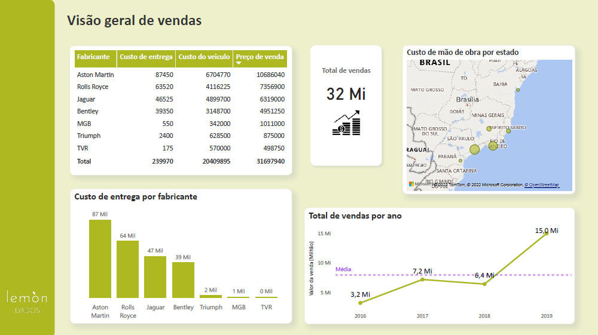
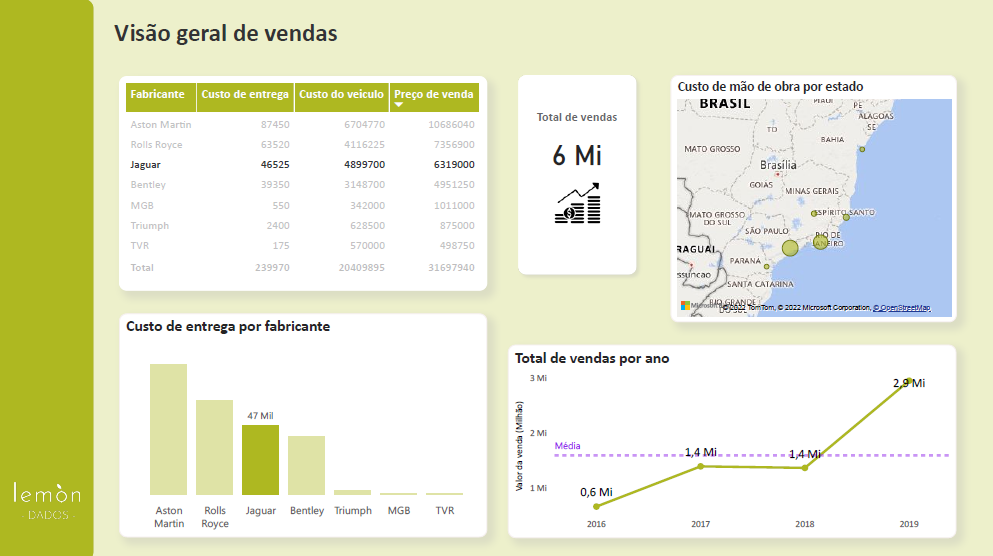

O estudo de caso discutido aqui faz parte do curso gratuito de Power bi da Data Science Academy. **Gratuito e com certificado!** 🗣️. Iremos abordar o problema de uma determinada empresa de automóveis que precisa de um dashboard contendo informações sobre as vendas da empresa entre os anos 2016 e 2019. Além disso, precisamos auxiliar o novo  CEO na decisão de permanecer ou não com a venda de uma das marcas de automóveis. 

Vamos lá? Vamos à história. 

## Introdução

A Radiator Springs é uma revendedora de automóveis de luxo fundada em 2016 na cidade de São Paulo. No ano de 2019 a empresa sofreu algumas mudanças, e uma delas foi a chegada do novo CEO. Com isso, o gerente precisou apresentar todas as informações sobre as vendas de automóveis no período de 2016 a 2019. Além disso, o CEO estava tendo dificuldades ao decidir se continuava ou não com a venda de automóveis da marca Jaguar.

Neste momento uma pergunta muito importante precisa ser respondida: **Você conseguiu pegar a referência contida neste post?** Uma dica:

<iframe src="https://giphy.com/embed/expSIcGXjZbe8" width="480" height="192" frameBorder="0" class="giphy-embed" allowFullScreen></iframe>
<a href="https://giphy.com/gifs/disneypixar-disney-pixar-expSIcGXjZbe8">via GIPHY</a>

E agora? 

Voltando para o nosso problema. A real pergunta é: **Como saber se o CEO deve continuar ou não com as vendas de automóveis da marca Jaguar?** 

## Desenhando uma solução

Uma possível solução consiste em verificar como as vendas de automóveis deste fabricante evoluíram por ano e qual o seu percentual de vendas em relação ao total. Mas antes disso, também é importante verificar as vendas das demais marcas e averiguar quais estão acima da média. Além disso, não podemos esquecer das informações que o gerente solicitou.

Assim, para representar todas essas informações e resolver o problema de negócio em questão, construí um Dashboard baseado no conjunto de dados disponibilizado.

A fonte de dados é um arquivo Excel com dados coletados do sistema de vendas e CRM da empresa, com a as seguintes informações:

| Variável | Descrição|
|---------:|----------|
| **DataNotaFiscal**|Data de emissão da nota fiscal |
| **Fabricante**    |Fabricante do veículo |
| **Estado**        |Estado onde foi realizada a venda |
|**PrecoVenda**     |Preço de venda do veículo|
|**PrecoCusto** | Preço de custo do veículo para a empresa|
|**TotalDesconto** | Total de Desconto fornecido sobre o preço de venda|
|**CustoEntrega** | Custo de entrega do veículo ao proprietário|
|**CustoMaoDeobra** | Custo de Mão de Obra (secretária, mecânico, etc...)|
|**NomeCliente** | Nome do cliente que comprou o veículo|
|**Modelo** | Modelo do veículo|
|**Cor** | Cor do veículo|
|**Ano** | Ano de fabricação do veículo|

## Desenvolvimento

Por ser o primeiro estudo de caso do curso e também o primeiro contato com a ferramenta, o dashboard foi desenvolvido junto com o professor. O objetivo aqui é familiarizar-se com o Power Bi. Entretanto, a minha escolha de gráficos foi um pouco diferente da escolha do professor. Isso porque tenho um certo desprezo pelos gráficos de pizza, nada pessoal, apenas estou de total acordo com a Cole Nussbaumer, quando ela afirma que gráficos de pizza são ruins, porque eles são! Além disso, quando os dados são contínuos e estão em alguma unidade de tempo (como dias, meses ou anos), geralmente, uso gráficos de linhas para visualizá-los.

Assim, todas as informações solicitadas pelo gerente foram entregues. 

 

Em relação a marca Jaguar, as principais conclusões que podemos extrair do dashboard acima são:

- Dos 32 milhões de automóveis vendidos, 6 milhões eram da marca Jaguar, representando cerca de 18,75% das vendas;

- Comparado com as marcas Aston Martin e Rolls Royce, que possuem os maiores custos, e consequentemente, os dois maiores preços de vendas, a Jaguar apresentou a menor diferença  entre o preço de venda e o custo do veículo.

- Houve um aumento considerável nas vendas totais no ano de 2019, incluindo a marca Jaguar. Por isso, devemos ter um certo cuidado ao tomar decisões aqui, pois esse aumento pode ter influenciado a média. 

Agora cabe ao CEO decidir se continua ou não com a marca Jaguar, baseado nas informações contidas nos dados. 

---
Esse foi o primeiro Dashboard que fiz na vida! Tem muito espaço para melhoria, mas estou orgulhosa de mim.

O ideal seria fazer uma análise exploratória para compreender melhor os dados, porém segui o que foi feito na aula. Acredito que os próximos exemplos irão abordar conteúdos mais complexos. 

As minhas impressões sobre o curso até o momento:

- O curso é bastante dinâmico e a todo momento o professor nos incentiva a praticar e pensar de forma crítica e analítica (pra rimar).

- O Power Bi, assim como as outras ferramentas da Microsoft, é bastante intuitivo. Você consegue usar a ferramenta tranquilamente e aprender com facilidade. 

- A parte mais difícil deste estudo de caso foi organizar os gráficos em um painel. Sério! Após finalizar o segundo capítulo do curso constatei que preciso saber mais sobre design: *Layout*, cores, tipografia… 🤯.

- É um estudo de caso bastante simples, mas pelo que vi dos capítulos seguintes, a complexidade dos problemas vai aumentando ao longo do curso e o intuito é aprender não somente a ferramenta, como também desenvolver o pensamento analítico. 

- Na graduação de Estatística os problemas abordados são bastantes teóricos, e na maioria das vezes são apresentados em relatórios extensos, focados em validar/aplicar a teoria abordada e não em resolver o problema em si. Por isso estou buscando preencher essa lacuna deixada pela graduação ao analisar dados na perspectiva de negócios, e claro, contar uma narrativa de dados. 

### Brisas aleatórias

- Por alguma razão que eu desconheço, a minha borracha tem a imagem do relâmpago McQueen (popularmente conhecido como relâmpago Marquinhos) do filme Carros. Por isso escolhi o nome da empresa fictícia de automóveis como “Radiator Springs”, pois esse é o nome da cidade do filme. (Pegou a referência agora?)

- Esse filme foi lançado em 2006 😮 e eu lembro perfeitamente dele. Meu Deus, estou ficando velha, e se você leu até aqui, provavelmente está pensando o mesmo. 
 

---
### Referências:
Imagem da capa: <a href="https://www.freepik.com/photos/digital-team">Digital team photo created by ijeab - www.freepik.com</a>

Curso e dados utilizados: <a href="https://www.datascienceacademy.com.br/">www.datascienceacademy.com.br</a>

