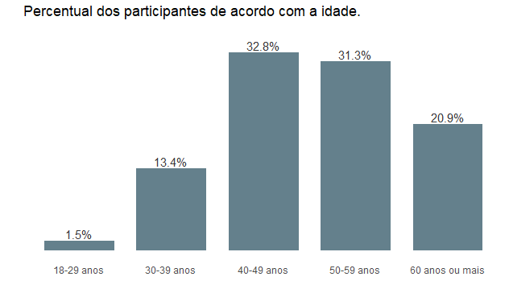
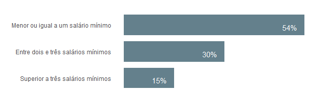
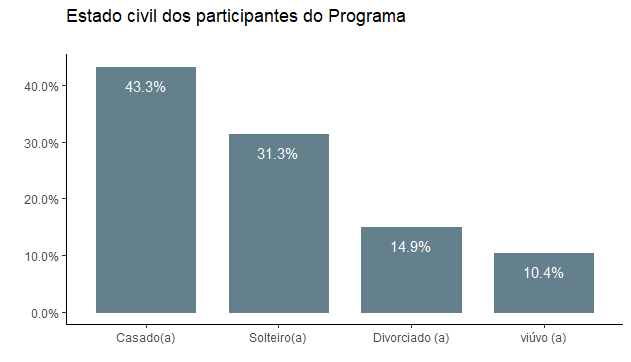
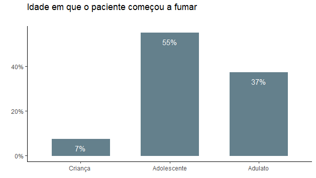
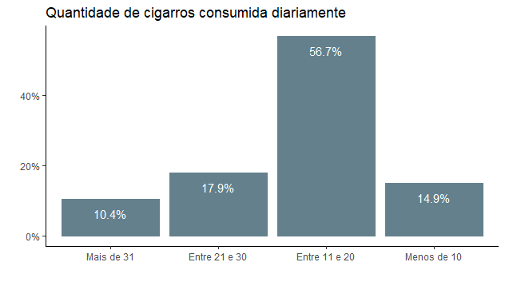
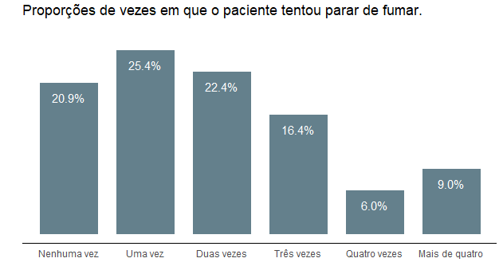
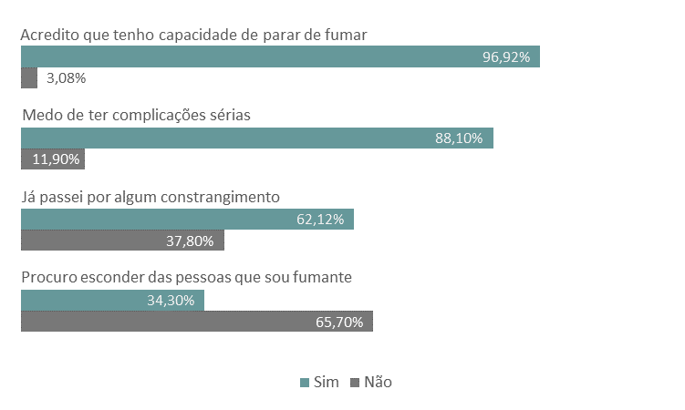
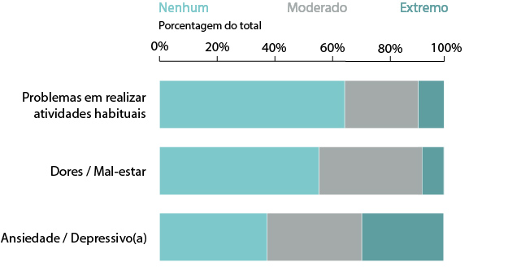
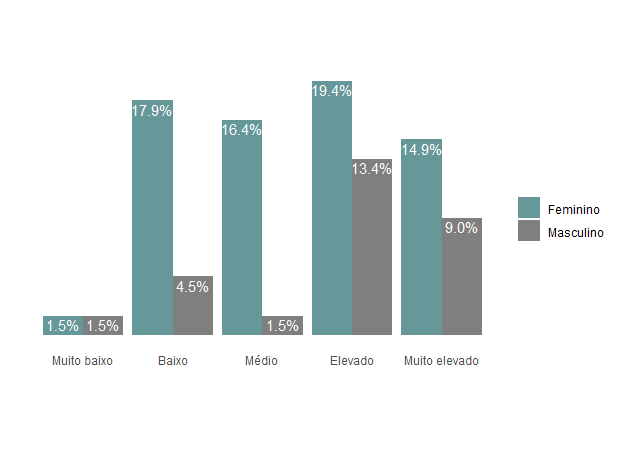
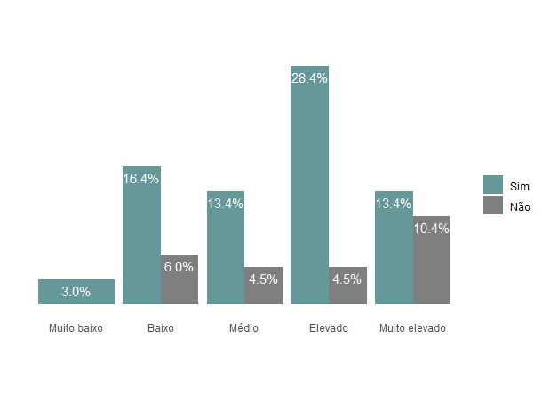

## Introdução

Olá!

Esse post faz parte de uma série de posts, que tem como objetivo documentar algumas das minhas atividades desenvolvidas durante a realização do estágio supervisionado, que foi realizado no Laboratório de Análises Estatísticas - LANEST, localizado na Universidade Federal de Campina Grande (UFCG). 

Esse é o segundo post, então caso não tenha lido o post anterior, acesse esse link! 

--- 

A manipulação de dados, bem como as análises e visualizações foram realizadas
no *Software R*, também utilizei o *Microsoft Excel* e *Adobe Illustrator* para auxiliar na criação de alguns gráficos. Como todas as variáveis eram categóricas, para a visualização de informações foram utilizados tabelas e gráficos de barras. Os códigos estão disponíveis no meu Github ([clique aqui](https://github.com/rodriguesbianca/perfil-epidemiologico)).

## Análise de dados 
No Programa de Tratamento do Tabagismo, entre os anos de 2016 a 2020, 70,1% dos pacientes eram do sexo feminino, enquanto 29,9% eram do sexo masculino. 

Com relação à idade, 32,8% dos pacientes tinham entre 40 e 49 anos. Além disso, pela Figura 1, vemos que aproximadamente, 31,3% tinham idades entre 50 e 59 anos, aqueles com 60 anos ou mais corresponderam a 20,9% do total e 13, 4% apresentaram idades entre 30 e 39 anos e apenas 1,5% tinham entre 18 e 29 anos. 

    
  
  *Figura 1: Gráfico de barras relativo ao Percentual dos participantes de acordo com a idade.*

A Tabela abaixo contém os dados referentes ao nível de escolaridade, em que 28, 4%
dos participantes declararam ter apenas o ensino fundamental incompleto, enquanto
17, 9% disseram ter o ensino fundamental completo. Sobre o ensino médio, 25, 4% disseram ter o ensino médio completo, e 4, 5% incompleto. Já quanto ao nível superior, 20, 9% disseram ter ensino superior completo e 1, 5% o ensino superior incompleto. Apenas uma pessoa optou por não responder.

| Escolaridade                  | Total | Percentual |
|-------------------------------|:-----:|:----------:|
| Ensino fundamental incompleto |   19  |   28, 4%   |
| Ensino fundamental completo   |   12  |   17, 9%   |
| Ensino médio incompleto       |   3   |    4, 5%   |
| Ensino médio completo         |   17  |   25, 4%   |
| Ensino superior incompleto    |   1   |    1, 5%   |
| Ensino superior completo      |   14  |   20, 9%   |

No que diz respeito à renda familiar, 1% dos entrevistados não responderam e, pelo gráfico apresentado na Figura 2, podemos ver que a renda familiar mensal da maior parte dos entrevistados, isto é, 55%, é menor ou igual a um salário mínimo, 30% entre dois e três salários mínimos e 15% declararam ter uma renda superior a três salários mínimos.

    
  
  *Figura 2: Gráfico de barras baseado nas respostas sobre a renda familiar.*

Quanto ao estado civil, 43,3% dos participantes do programa eram casadas(os) ou vivem com companheiros(as). De acordo com o gráfico apresentado na Figura (3), 31,3% afirmaram ser solteiros(as), enquanto 14,9% eram divorciados(as) ou separados(as) e 10,4% declararam ser viúvos(as).

    
  
  *Figura 3: Gráfico de barras baseado nas respostas sobre o Estado civil.*

Quando questionados sobre a idade em que começaram a fumar, as respostas variaram entre 9 e 41 anos. Em média, os entrevistados começaram a fumar aos 16 anos. 
Para a realização deste estudo foi proposta a categorização das idades em três (3) faixas etárias. São elas:

- **Criança:** a pessoa com até doze anos de idade incompletos;
- **Adolescente:** aquela com idade entre doze e dezoito anos;
- **Adultos:** a pessoa com idade a partir de dezoito anos.

Assim, pela Figura (4) vemos que 55% dos entrevistados começaram a fumar
durante a adolescência e 7% começaram a fumar ainda crianças.

    
  
  *Figura 4: Gráfco de barras baseado nas respostas sobre a idade em que os pacientes começaram a fumar.*

Em relação à quantidade de cigarros consumidos diariamente, a maioria dos participantes do programa consomem entre 11 a 20 cigarros, correspondendo a um total de 56, 7% dos entrevistados. Pelo gráfico apresentado na Figura (5), vemos que 17, 9% utilizam entre 21 e 30 cigarros.  

Levando em consideração que o acondicionamento de cigarros destinados à comercialização geralmente é feito em maço ou carteira de 20 cigarros cada, isto implica dizer que, ao somar o percentual de participantes que fazem uso de mais de 31 cigarros por dia, **28, 3% dos participantes do programa consomem mais de uma carteira de cigarros diariamente**.

    
  
  *Figura 5: Gráfco de barras baseado nas respostas sobre a quantidade de cigarros consumidos diariamente.*

Sobre a quantidade de vezes em que os participantes do programa tentaram parar
de fumar, 79,1% afirmaram já tentar parar de fumar, mas não conseguiram. 31, 4%
deles também disseram ter tentado parar de fumar ao menos 3 vezes, 25% disseram que tentaram apenas uma vez e 20, 9% afirmaram que não tentaram parar de fumar nenhuma vez.

    
  
  *Figura 6: Gráfco de barras baseado nas respostas sobre a quantidade de cigarros consumidos diariamente.*

Entre os participantes do programa que responderam às perguntas acerca dos aspectos psicológicos, pelo Gráfico da Figura (7), podemos ver que, aproximadamente 34,30% dos participantes procuram esconder das pessoas que é fumante. 96,92% acredita ter a capacidade de parar de fumar, enquanto 88, 10% diz ter medo de ter complicações sérias, e 62,12% alegam ter passado por algum constrangimento por causa do hábito de fumar.

    
  
  *Figura 7: Gráfico de barras baseado nas respostas dos participantes em relação ao seu aspecto psicológico.*

A Figura (8) resume as informações sobre a qualidade de vida dos participantes do Programa. No que se refere às atividades habituais (como trabalho, estudos, atividades domésticas, atividades em família ou de lazer, entre outros), foi questionado aos participantes se eles possuíam algum problema em desempenhar tais atividades em decorrência ao uso do cigarro. Os resultados mostraram que 65,7% não tem problemas em realizar essas atividades, 25,4% diz ter problemas em desempenhá-las, enquanto 9% é incapaz de desempenhar as suas atividades habituais.

    
  
  *Figura 8: Gráfico de barras baseado nas respostas dos participantes em relação à avaliação sobre a qualidade de vida.*

Quanto a sentir dores ou mal-estar, 55,2% alegam não sentir, 35,8% sentem moderadamente e 9% tem dores ou mal-estar extremos. Além disso, 28,4% dos participantes do programa afirmaram se sentir extremamente ansiosos(as) ou depressivos(as), enquanto
32,8% sentem ansiosos(as) ou depressivos(as) de forma moderada, já 37,3% dizem não sentir nenhum tipo de ansiedade. 

De acordo com o teste de Fagerström, os dados mostraram que os participantes do programa possuem graus mais elevados de dependência sendo 32,8% elevado e 23,9% muito elevado. Apenas 3% apresentaram grau muito baixo. Pelo gráfico da Figura (9), pode-se ver o percentual de cada nível de dependência de acordo com o sexo dos participantes. É possível perceber que os percentuais referentes
à maioria dos níveis foram bem semelhante para o sexo feminino, apresentando uma maior proporção para os níveis elevados e baixo. Já para o sexo masculino os percentuais foram um pouco diferente, as maiores proporções foram para os níveis elevados e muito elevados,
respectivamente.

    
  
  *Figura 9: Gráfico de barras baseado no teste de Fagerström em relação ao sexo biológico dos participantes do PMTT.*

Quanto aos demais dados sociodemográficos, tanto a escolaridade como a renda familiar e o estado civil apresentaram proporções bem distribuídas em relação ao teste, isto implica dizer que não há indícios de que os dados sociodemográficos influenciam no grau de dependência à nicotina.

*Tabela 2: Porcentagens dos participantes do PMTT de acordo com o nível de escolaridade e grau de dependência a nicotina.*
|                        | Muito baixo | Baixo | Médio | Elevado | Muito elevado |
|------------------------|:-----------:|:-----:|:-----:|:-------:|:-------------:|
| Fundamental incompleto |      0%     |   6%  |   6%  | **15%** |       2%      |
| Fundamental completo   |      2%     |   2%  |   2%  |    6%   |       8%      |
| Médio incompleto       |      0%     |   0%  |   3%  |    0%   |       2%      |
| Médio completo         |      0%     |   6%  |   3%  |    9%   |       8%      |
| Superior incompleto    |      0%     |   0%  |   0%  |    2%   |       0%      |
| Superior completo      |      2%     |   9%  |   5%  |    2%   |       5%      |

No que diz respeito aos aspectos psicológicos, os dados informados mostraram que as maiores proporções foram para aqueles que apresentaram grau de dependência mais elevados, isto é, 31% dos participantes com grau elevado procuram esconder das pessoas
que é fumante, 81% afirmam ter medo de ter complicações sérias e a maioria deles alegam que já passaram por algum constrangimento por causa do hábito de fumar.

As taxas do grau de nicotina em relação ao histórico tabagista dos participantes estão apresentadas nas Figuras (10) e (11). As maiores proporções observadas foram referentes aos níveis elevados de dependência à nicotina. Por exemplo, aproximadamente 22% dos participantes que consumiam entre 11 e 20 cigarros apresentaram nível elevado no teste de *Fagerström*. Aqueles que apresentaram nível muito baixo de dependência consumiam menos de 10 cigarros diariamente.

    
  
  *Figura 10: Gráfico de barras baseado na relação entre a quantidade de cigarros consumidas diariamente com o grau de depedência à nicotina.*

Entre os participantes que armaram parar de fumar, mas retomaram ao hábito, 28,4% apresentaram nível elevado no teste de Fagerström. Além disso, pela Figura (11) vemos que 13,4% mostraram níveis muito elevado e médio, 16,4% baixo e apenas 3% obtiveram o grau muito baixo.

    
  
  *Figura 12: Gráfico de barras baseado no teste de Fagerström em relação a ter parado de fumar ou não.*

| Atividades habituais | Muito baixo | Baixo | Médio | Elevado | Muito elevado |
|----------------------|:-----------:|:-----:|:-----:|:-------:|:-------------:|
|               Nenhum |      0      |  17%  |  11%  |   24%   |      14%      |
|             Moderado |      3%     |   5%  |   3%  |    6%   |       9%      |
|              Extremo |      0      |   2%  |   3%  |    3%   |       2%      |

| Dor e/ou Mal-estar | Muito baixo | Baixo | Médio | Elevado | Muito elevado |
|--------------------|:-----------:|:-----:|:-----:|:-------:|:-------------:|
|             Nenhum |      3%     |  13%  |   7%  |   21%   |      10%      |
|           Moderado |      0      |   6%  |   9%  |   10%   |      10%      |
|            Extremo |      0      |   3%  |   1%  |    1%   |       3%      |

| Ansiedade e/ou Depressão | Muito baixo | Baixo | Médio | Elevado | Muito elevado |
|--------------------------|:-----------:|:-----:|:-----:|:-------:|:-------------:|
|                   Nenhum |      0      |  11%  |   5%  |   15%   |       8%      |
|                 Moderado |      2%     |   9%  |   5%  |    9%   |       9%      |
|                  Extremo |      2%     |   2%  |   9%  |    9%   |       8%      |

As tabelas acima mostram as porcentagens do teste de *Fagerström* em cada uma das categorias sobre a qualidade de vida dos participantes. Os maiores percentuais apresentados foram para aqueles que apresentaram grau elevado no teste. Para verificar a existência de associação entre as variáveis em estudo com o grau de dependência à nicotina, foi
realizado o teste de independência Qui-quadrado.

Após realizar o teste, unicamente para os dados sobre a quantidade de cigarros consumidas diariamente rejeitou a hipótese nula ao nível de 5% de confiança e, portanto, há indícios de associação entre a quantidade de cigarros consumidas com o grau de dependência a nicotina. A Tabela abaixo mostra os resultados dos testes para todas as variáveis.

| Variável                                    | Estatística | p - valor |
|---------------------------------------------|-------------|-----------|
| Idade                                       | 19,12       | 0,213     |
| Sexo                                        | 5,47        | 0,252     |
| Estado civil                                | 11,43       | 0,523     |
| Renda familiar                              | 10,62       | 0,233     |
| Escolaridade                                | 25,41       | 0,171     |
| Atividades habituais                        | 9,34        | 0,313     |
| Dos/Mal-estar                               | 5,18        | 0,757     |
| Ansiedade/Depressão                         | 7,98        | 9,442     |
| Começou a fumar                             | 75,12       | 0,280     |
| Procura esconder que é fumante              | 6,07        | 0,197     |
| Medo de ter complicações sérias             | 1,32        | 0,886     |
| Tentou parar de fumar, mas não conseguiu    | 5,15        | 0,293     |
| Passou por algum constrangimento            | 8,97        | 0,064     |
| Acredita ter a capacidade de parar de fumar | 8,25        | 0,138     |
| Já tentou parar de fumar                    | 19,98       | 0,476     |
| **Cigarros diarios**                        | **32,59**   | **0,002**    |

Assim, o nível do teste está relacionado positivamente com a quantidade de cigarros consumidas diariamente. Ou seja quanto mais cigarros por dia forem consumidos, maior será o nível de dependência. 
