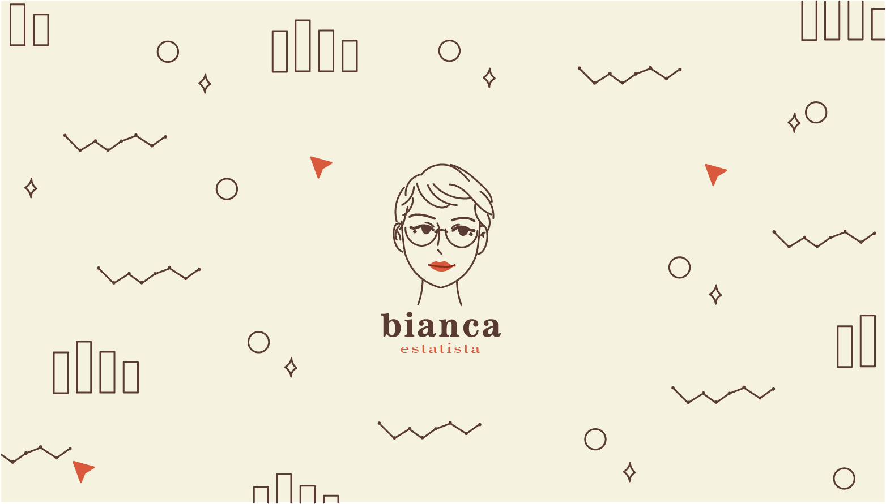
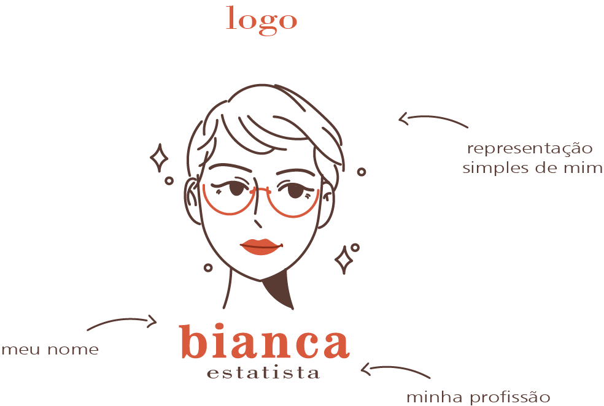
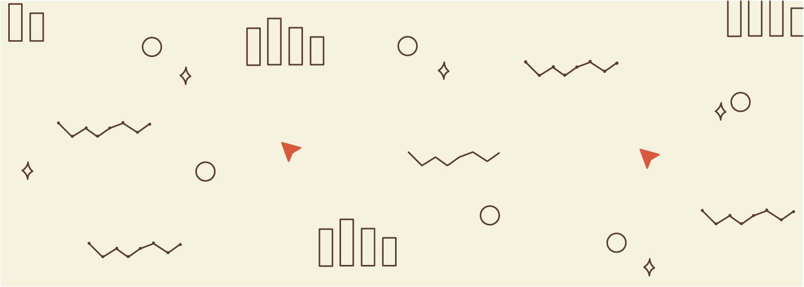
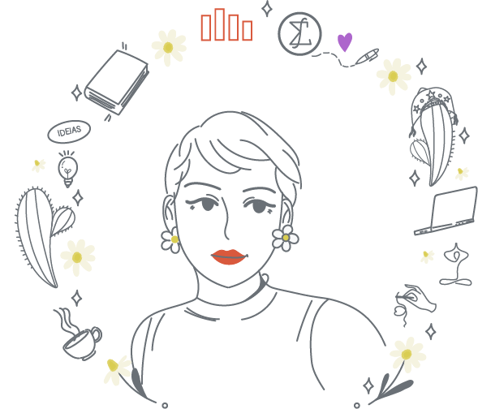

---

---

O padrão de elementos foi criado baseado no meu ambiente de trabalho como Analista de dados/Estatístico: as quatro barras representam um gráfico de barras, o círculo e o segmento de pontos representam, respectivamente, um gráfico de setores (ou pizza) e um gráfico de linhas. Além disso, temos a seta simbolizando o *software* que uso para criar os desenhos.

---
Por fim, fiz um resumo visual de tudo aquilo que constitui a pessoa que sou hoje: Nordeste, estudos, criatividade, desenhos, café, yoga, bordado, estatística e o coração roxo representando o bts &#128156;.

---
Criar esta marca me ajudou muito a me entender como pessoa e profissional. Foi um processo divertido e estimulante. Além disso, pude refletir sobre quem sou e como gostaria de ser no futuro. Sou muito grata pelo aprendizado. 
